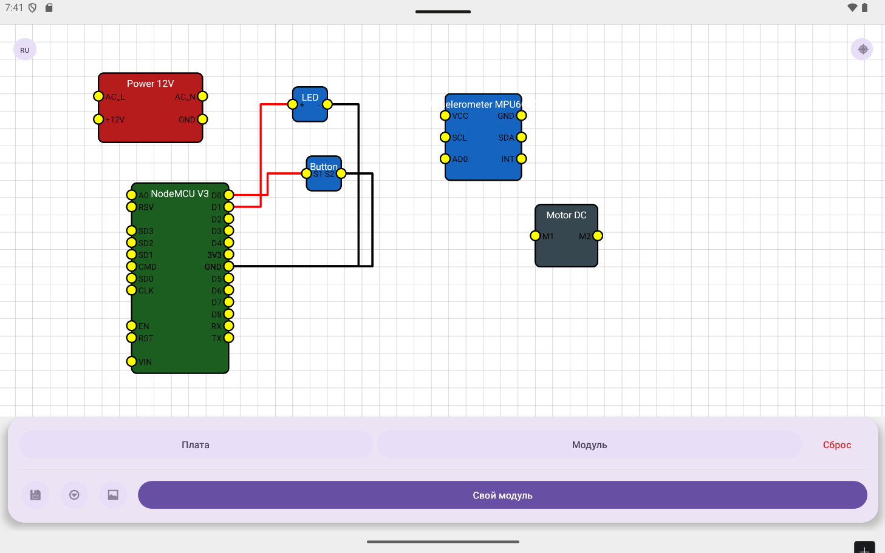
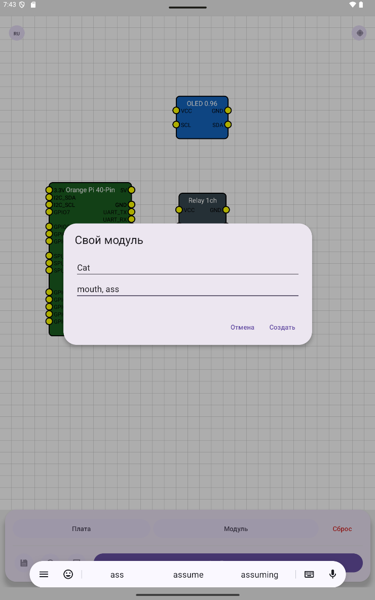
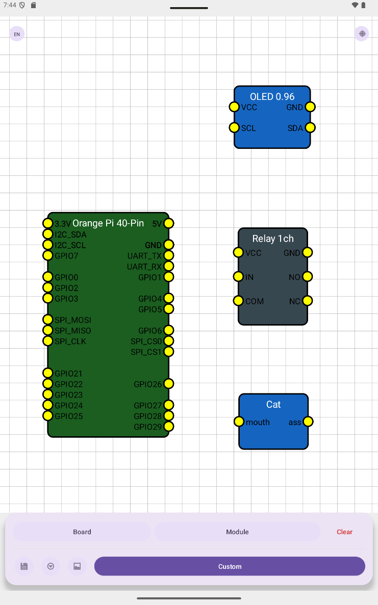

//Собрал на коленке с помощью ИИ, сильно не пинайте)).

# ArduSketch — программа для эскизирования сборок на Arduino

Простой инструмент для визуализации электронных схем на базе Arduino. Создавайте наглядные эскизы подключений прямо на смартфоне.

## Возможности

* Визуальное проектирование схем с компонентами Arduino
* Библиотека готовых элементов (датчики, резисторы, светодиоды и т. д.)
* Экспорт схемы в изображение
* Сохранение проектов для дальнейшего редактирования
* Интуитивный интерфейс для быстрого прототипирования





* Android 6.0 (Marshmallow) или выше
* 1 GB оперативной памяти
* 50 MB свободного места на устройстве

Скачайте последнюю версию APK-файла из раздела [Releases](https://github.com/zelgadisexe/ArduSketch/releases) или соберите проект самостоятельно.

## Сборка проекта

1. Клонируйте репозиторий:
   ```bash
   git clone https://github.com/zelgadisexe/ArduSketch.git
